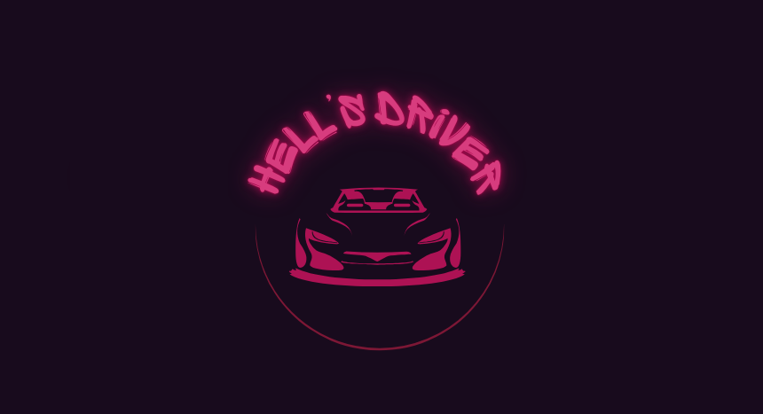

# *HELL'S DRIVER*

## [Play the Game!](https://plperezp.github.io/Hells-Driver/)

# Description

*"Hell's Driver: El Juego de Conducción Definitivo"*

¡Sube al volante y desata el caos en las calles! En *Hell's Driver* , atropellar no solo es permitido… ¡es tu misión! Enfréntate a un mundo sin reglas, donde los peatones son puntos, los coches enemigos son obstáculos, y el camino a la victoria es a través de la destrucción. ¿Te atreves a poner a prueba tus reflejos y tu moral?

Conduce como un maníaco: Toma el control de tu vehiculo y corre a través de la ciudad infestada de peatones desprevenidos. ¡Cuantos más atropelles, más puntos ganas!
Modo borracho: ¿Te crees valiente? Toma un trago y ve cómo tu habilidad se distorsiona. Conducir borracho no es fácil, pero los puntos valen el riesgo.

Sin reglas, solo caos: No hay límites. Estrellarte contra peatones es parte del juego. La única regla es causar el máximo caos sin perder tu vida.
¡Prepárate para una adrenalina sin fin! En *Hell's Driver*, la carretera es tu campo de batalla. ¡Aplasta, destruye y ríe mientras lo haces!.

# Main Functionalities

- Diferentes clases (mainCar, enemyCar, hippies, mainstreamers, beerBooster)
- Reproduce /pausa audio
- Colisión contra personas, vehiculos y gamebox
- Movimiento de objetos
- Movimiento de vehiculo por parte de usuario sin distinción de mayúsculas o minúsculas

# Backlog Functionalities

- Aumento de puntos durante el modo borracho
- Booster de arma temporal para el mainCar
- Modificación en la funcionalidad de los controles durante el modo borracho
- Nuevas pantallas de juego con diferente background
- Implementación para movil

# Technologies used

- HTML
- CSS
- JavaScript
- DOM Manipulation
- Local Storage

# States

- Splash Screen
- Game Screen
- Game Over Screen

# Extra Links

### Sketch

[Link](https://excalidraw.com/#json=J9vUkmWRDE4YqYBlG_-yK,Lu4gkQcNhFvDRGhaqifkLw)

### Slides

[Link](https://docs.google.com/presentation/d/1Z_JsoSdH7qpyCBI7FmYOHoyHht4gv7oYJFplqn6tScw/edit?usp=drive_link)

### Deploy

[Link](https://plperezp.github.io/Hells-Driver/)

# Special Thanks
 
 - Thanks to Room-12 *“where the dreams come true”* because without them, this game doesn't have sense.